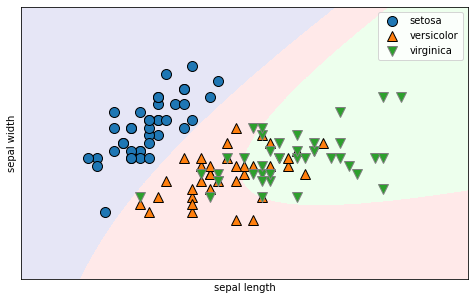

```python
import pandas as pd
import seaborn as sns
import matplotlib.pyplot as plt
from sklearn.datasets import load_iris
from sklearn.model_selection import train_test_split
from sklearn.svm import SVC
import mglearn
from sklearn.metrics import accuracy_score
%matplotlib inline

iris=load_iris()
iris

```


    {'data': array([[5.1, 3.5, 1.4, 0.2],
            [4.9, 3. , 1.4, 0.2],
            [4.7, 3.2, 1.3, 0.2],
            [4.6, 3.1, 1.5, 0.2],
            [5. , 3.6, 1.4, 0.2],
            [5.4, 3.9, 1.7, 0.4],
            [4.6, 3.4, 1.4, 0.3],
            [5. , 3.4, 1.5, 0.2],
            [4.4, 2.9, 1.4, 0.2],
            [4.9, 3.1, 1.5, 0.1],
            [5.4, 3.7, 1.5, 0.2],
            [4.8, 3.4, 1.6, 0.2],
            [4.8, 3. , 1.4, 0.1],
            [4.3, 3. , 1.1, 0.1],
            [5.8, 4. , 1.2, 0.2],
            [5.7, 4.4, 1.5, 0.4],
            [5.4, 3.9, 1.3, 0.4],
            [5.1, 3.5, 1.4, 0.3],
            [5.7, 3.8, 1.7, 0.3],
            [5.1, 3.8, 1.5, 0.3],
            [5.4, 3.4, 1.7, 0.2],
            [5.1, 3.7, 1.5, 0.4],
            [4.6, 3.6, 1. , 0.2],
            [5.1, 3.3, 1.7, 0.5],
            [4.8, 3.4, 1.9, 0.2],
            [5. , 3. , 1.6, 0.2],
            [5. , 3.4, 1.6, 0.4],
            [5.2, 3.5, 1.5, 0.2],
            [5.2, 3.4, 1.4, 0.2],
            [4.7, 3.2, 1.6, 0.2],
            [4.8, 3.1, 1.6, 0.2],
            [5.4, 3.4, 1.5, 0.4],
            [5.2, 4.1, 1.5, 0.1],
            [5.5, 4.2, 1.4, 0.2],
            [4.9, 3.1, 1.5, 0.2],
            [5. , 3.2, 1.2, 0.2],
            [5.5, 3.5, 1.3, 0.2],
            [4.9, 3.6, 1.4, 0.1],
            [4.4, 3. , 1.3, 0.2],
            [5.1, 3.4, 1.5, 0.2],
            [5. , 3.5, 1.3, 0.3],
            [4.5, 2.3, 1.3, 0.3],
            [4.4, 3.2, 1.3, 0.2],
            [5. , 3.5, 1.6, 0.6],
            [5.1, 3.8, 1.9, 0.4],
            [4.8, 3. , 1.4, 0.3],
            [5.1, 3.8, 1.6, 0.2],
            [4.6, 3.2, 1.4, 0.2],
            [5.3, 3.7, 1.5, 0.2],
            [5. , 3.3, 1.4, 0.2],
            [7. , 3.2, 4.7, 1.4],
            [6.4, 3.2, 4.5, 1.5],
            [6.9, 3.1, 4.9, 1.5],
            [5.5, 2.3, 4. , 1.3],
            [6.5, 2.8, 4.6, 1.5],
            [5.7, 2.8, 4.5, 1.3],
            [6.3, 3.3, 4.7, 1.6],
            [4.9, 2.4, 3.3, 1. ],
            [6.6, 2.9, 4.6, 1.3],
            [5.2, 2.7, 3.9, 1.4],
            [5. , 2. , 3.5, 1. ],
            [5.9, 3. , 4.2, 1.5],
            [6. , 2.2, 4. , 1. ],
            [6.1, 2.9, 4.7, 1.4],
            [5.6, 2.9, 3.6, 1.3],
            [6.7, 3.1, 4.4, 1.4],
            [5.6, 3. , 4.5, 1.5],
            [5.8, 2.7, 4.1, 1. ],
            [6.2, 2.2, 4.5, 1.5],
            [5.6, 2.5, 3.9, 1.1],
            [5.9, 3.2, 4.8, 1.8],
            [6.1, 2.8, 4. , 1.3],
            [6.3, 2.5, 4.9, 1.5],
            [6.1, 2.8, 4.7, 1.2],
            [6.4, 2.9, 4.3, 1.3],
            [6.6, 3. , 4.4, 1.4],
            [6.8, 2.8, 4.8, 1.4],
            [6.7, 3. , 5. , 1.7],
            [6. , 2.9, 4.5, 1.5],
            [5.7, 2.6, 3.5, 1. ],
            [5.5, 2.4, 3.8, 1.1],
            [5.5, 2.4, 3.7, 1. ],
            [5.8, 2.7, 3.9, 1.2],
            [6. , 2.7, 5.1, 1.6],
            [5.4, 3. , 4.5, 1.5],
            [6. , 3.4, 4.5, 1.6],
            [6.7, 3.1, 4.7, 1.5],
            [6.3, 2.3, 4.4, 1.3],
            [5.6, 3. , 4.1, 1.3],
            [5.5, 2.5, 4. , 1.3],
            [5.5, 2.6, 4.4, 1.2],
            [6.1, 3. , 4.6, 1.4],
            [5.8, 2.6, 4. , 1.2],
            [5. , 2.3, 3.3, 1. ],
            [5.6, 2.7, 4.2, 1.3],
            [5.7, 3. , 4.2, 1.2],
            [5.7, 2.9, 4.2, 1.3],
            [6.2, 2.9, 4.3, 1.3],
            [5.1, 2.5, 3. , 1.1],
            [5.7, 2.8, 4.1, 1.3],
            [6.3, 3.3, 6. , 2.5],
            [5.8, 2.7, 5.1, 1.9],
            [7.1, 3. , 5.9, 2.1],
            [6.3, 2.9, 5.6, 1.8],
            [6.5, 3. , 5.8, 2.2],
            [7.6, 3. , 6.6, 2.1],
            [4.9, 2.5, 4.5, 1.7],
            [7.3, 2.9, 6.3, 1.8],
            [6.7, 2.5, 5.8, 1.8],
            [7.2, 3.6, 6.1, 2.5],
            [6.5, 3.2, 5.1, 2. ],
            [6.4, 2.7, 5.3, 1.9],
            [6.8, 3. , 5.5, 2.1],
            [5.7, 2.5, 5. , 2. ],
            [5.8, 2.8, 5.1, 2.4],
            [6.4, 3.2, 5.3, 2.3],
            [6.5, 3. , 5.5, 1.8],
            [7.7, 3.8, 6.7, 2.2],
            [7.7, 2.6, 6.9, 2.3],
            [6. , 2.2, 5. , 1.5],
            [6.9, 3.2, 5.7, 2.3],
            [5.6, 2.8, 4.9, 2. ],
            [7.7, 2.8, 6.7, 2. ],
            [6.3, 2.7, 4.9, 1.8],
            [6.7, 3.3, 5.7, 2.1],
            [7.2, 3.2, 6. , 1.8],
            [6.2, 2.8, 4.8, 1.8],
            [6.1, 3. , 4.9, 1.8],
            [6.4, 2.8, 5.6, 2.1],
            [7.2, 3. , 5.8, 1.6],
            [7.4, 2.8, 6.1, 1.9],
            [7.9, 3.8, 6.4, 2. ],
            [6.4, 2.8, 5.6, 2.2],
            [6.3, 2.8, 5.1, 1.5],
            [6.1, 2.6, 5.6, 1.4],
            [7.7, 3. , 6.1, 2.3],
            [6.3, 3.4, 5.6, 2.4],
            [6.4, 3.1, 5.5, 1.8],
            [6. , 3. , 4.8, 1.8],
            [6.9, 3.1, 5.4, 2.1],
            [6.7, 3.1, 5.6, 2.4],
            [6.9, 3.1, 5.1, 2.3],
            [5.8, 2.7, 5.1, 1.9],
            [6.8, 3.2, 5.9, 2.3],
            [6.7, 3.3, 5.7, 2.5],
            [6.7, 3. , 5.2, 2.3],
            [6.3, 2.5, 5. , 1.9],
            [6.5, 3. , 5.2, 2. ],
            [6.2, 3.4, 5.4, 2.3],
            [5.9, 3. , 5.1, 1.8]]),
     'target': array([0, 0, 0, 0, 0, 0, 0, 0, 0, 0, 0, 0, 0, 0, 0, 0, 0, 0, 0, 0, 0, 0,
            0, 0, 0, 0, 0, 0, 0, 0, 0, 0, 0, 0, 0, 0, 0, 0, 0, 0, 0, 0, 0, 0,
            0, 0, 0, 0, 0, 0, 1, 1, 1, 1, 1, 1, 1, 1, 1, 1, 1, 1, 1, 1, 1, 1,
            1, 1, 1, 1, 1, 1, 1, 1, 1, 1, 1, 1, 1, 1, 1, 1, 1, 1, 1, 1, 1, 1,
            1, 1, 1, 1, 1, 1, 1, 1, 1, 1, 1, 1, 2, 2, 2, 2, 2, 2, 2, 2, 2, 2,
            2, 2, 2, 2, 2, 2, 2, 2, 2, 2, 2, 2, 2, 2, 2, 2, 2, 2, 2, 2, 2, 2,
            2, 2, 2, 2, 2, 2, 2, 2, 2, 2, 2, 2, 2, 2, 2, 2, 2, 2]),
     'frame': None,
     'target_names': array(['setosa', 'versicolor', 'virginica'], dtype='<U10'),
     'DESCR': '.. _iris_dataset:\n\nIris plants dataset\n--------------------\n\n**Data Set Characteristics:**\n\n    :Number of Instances: 150 (50 in each of three classes)\n    :Number of Attributes: 4 numeric, predictive attributes and the class\n    :Attribute Information:\n        - sepal length in cm\n        - sepal width in cm\n        - petal length in cm\n        - petal width in cm\n        - class:\n                - Iris-Setosa\n                - Iris-Versicolour\n                - Iris-Virginica\n                \n    :Summary Statistics:\n\n    ============== ==== ==== ======= ===== ====================\n                    Min  Max   Mean    SD   Class Correlation\n    ============== ==== ==== ======= ===== ====================\n    sepal length:   4.3  7.9   5.84   0.83    0.7826\n    sepal width:    2.0  4.4   3.05   0.43   -0.4194\n    petal length:   1.0  6.9   3.76   1.76    0.9490  (high!)\n    petal width:    0.1  2.5   1.20   0.76    0.9565  (high!)\n    ============== ==== ==== ======= ===== ====================\n\n    :Missing Attribute Values: None\n    :Class Distribution: 33.3% for each of 3 classes.\n    :Creator: R.A. Fisher\n    :Donor: Michael Marshall (MARSHALL%PLU@io.arc.nasa.gov)\n    :Date: July, 1988\n\nThe famous Iris database, first used by Sir R.A. Fisher. The dataset is taken\nfrom Fisher\'s paper. Note that it\'s the same as in R, but not as in the UCI\nMachine Learning Repository, which has two wrong data points.\n\nThis is perhaps the best known database to be found in the\npattern recognition literature.  Fisher\'s paper is a classic in the field and\nis referenced frequently to this day.  (See Duda & Hart, for example.)  The\ndata set contains 3 classes of 50 instances each, where each class refers to a\ntype of iris plant.  One class is linearly separable from the other 2; the\nlatter are NOT linearly separable from each other.\n\n.. topic:: References\n\n   - Fisher, R.A. "The use of multiple measurements in taxonomic problems"\n     Annual Eugenics, 7, Part II, 179-188 (1936); also in "Contributions to\n     Mathematical Statistics" (John Wiley, NY, 1950).\n   - Duda, R.O., & Hart, P.E. (1973) Pattern Classification and Scene Analysis.\n     (Q327.D83) John Wiley & Sons.  ISBN 0-471-22361-1.  See page 218.\n   - Dasarathy, B.V. (1980) "Nosing Around the Neighborhood: A New System\n     Structure and Classification Rule for Recognition in Partially Exposed\n     Environments".  IEEE Transactions on Pattern Analysis and Machine\n     Intelligence, Vol. PAMI-2, No. 1, 67-71.\n   - Gates, G.W. (1972) "The Reduced Nearest Neighbor Rule".  IEEE Transactions\n     on Information Theory, May 1972, 431-433.\n   - See also: 1988 MLC Proceedings, 54-64.  Cheeseman et al"s AUTOCLASS II\n     conceptual clustering system finds 3 classes in the data.\n   - Many, many more ...',
     'feature_names': ['sepal length (cm)',
      'sepal width (cm)',
      'petal length (cm)',
      'petal width (cm)'],
     'filename': 'C:\\ProgramData\\Anaconda3\\lib\\site-packages\\sklearn\\datasets\\data\\iris.csv'}


iris[' ']

 -DESCR : 데이터셋 정보  
 -data : feature data  
 -feature_names : feature data의 컬럼 이름(열 이름들)  
 -target : label data(수치형)  
 -target_names : label의 (문자형)iris  


```python
iris['DESCR']
```


    '.. _iris_dataset:\n\nIris plants dataset\n--------------------\n\n**Data Set Characteristics:**\n\n    :Number of Instances: 150 (50 in each of three classes)\n    :Number of Attributes: 4 numeric, predictive attributes and the class\n    :Attribute Information:\n        - sepal length in cm\n        - sepal width in cm\n        - petal length in cm\n        - petal width in cm\n        - class:\n                - Iris-Setosa\n                - Iris-Versicolour\n                - Iris-Virginica\n                \n    :Summary Statistics:\n\n    ============== ==== ==== ======= ===== ====================\n                    Min  Max   Mean    SD   Class Correlation\n    ============== ==== ==== ======= ===== ====================\n    sepal length:   4.3  7.9   5.84   0.83    0.7826\n    sepal width:    2.0  4.4   3.05   0.43   -0.4194\n    petal length:   1.0  6.9   3.76   1.76    0.9490  (high!)\n    petal width:    0.1  2.5   1.20   0.76    0.9565  (high!)\n    ============== ==== ==== ======= ===== ====================\n\n    :Missing Attribute Values: None\n    :Class Distribution: 33.3% for each of 3 classes.\n    :Creator: R.A. Fisher\n    :Donor: Michael Marshall (MARSHALL%PLU@io.arc.nasa.gov)\n    :Date: July, 1988\n\nThe famous Iris database, first used by Sir R.A. Fisher. The dataset is taken\nfrom Fisher\'s paper. Note that it\'s the same as in R, but not as in the UCI\nMachine Learning Repository, which has two wrong data points.\n\nThis is perhaps the best known database to be found in the\npattern recognition literature.  Fisher\'s paper is a classic in the field and\nis referenced frequently to this day.  (See Duda & Hart, for example.)  The\ndata set contains 3 classes of 50 instances each, where each class refers to a\ntype of iris plant.  One class is linearly separable from the other 2; the\nlatter are NOT linearly separable from each other.\n\n.. topic:: References\n\n   - Fisher, R.A. "The use of multiple measurements in taxonomic problems"\n     Annual Eugenics, 7, Part II, 179-188 (1936); also in "Contributions to\n     Mathematical Statistics" (John Wiley, NY, 1950).\n   - Duda, R.O., & Hart, P.E. (1973) Pattern Classification and Scene Analysis.\n     (Q327.D83) John Wiley & Sons.  ISBN 0-471-22361-1.  See page 218.\n   - Dasarathy, B.V. (1980) "Nosing Around the Neighborhood: A New System\n     Structure and Classification Rule for Recognition in Partially Exposed\n     Environments".  IEEE Transactions on Pattern Analysis and Machine\n     Intelligence, Vol. PAMI-2, No. 1, 67-71.\n   - Gates, G.W. (1972) "The Reduced Nearest Neighbor Rule".  IEEE Transactions\n     on Information Theory, May 1972, 431-433.\n   - See also: 1988 MLC Proceedings, 54-64.  Cheeseman et al"s AUTOCLASS II\n     conceptual clustering system finds 3 classes in the data.\n   - Many, many more ...'


```python
iris['data']
```


    array([[5.1, 3.5, 1.4, 0.2],
           [4.9, 3. , 1.4, 0.2],
           [4.7, 3.2, 1.3, 0.2],
           [4.6, 3.1, 1.5, 0.2],
           [5. , 3.6, 1.4, 0.2],
           [5.4, 3.9, 1.7, 0.4],
           [4.6, 3.4, 1.4, 0.3],
           [5. , 3.4, 1.5, 0.2],
           [4.4, 2.9, 1.4, 0.2],
           [4.9, 3.1, 1.5, 0.1],
           [5.4, 3.7, 1.5, 0.2],
           [4.8, 3.4, 1.6, 0.2],
           [4.8, 3. , 1.4, 0.1],
           [4.3, 3. , 1.1, 0.1],
           [5.8, 4. , 1.2, 0.2],
           [5.7, 4.4, 1.5, 0.4],
           [5.4, 3.9, 1.3, 0.4],
           [5.1, 3.5, 1.4, 0.3],
           [5.7, 3.8, 1.7, 0.3],
           [5.1, 3.8, 1.5, 0.3],
           [5.4, 3.4, 1.7, 0.2],
           [5.1, 3.7, 1.5, 0.4],
           [4.6, 3.6, 1. , 0.2],
           [5.1, 3.3, 1.7, 0.5],
           [4.8, 3.4, 1.9, 0.2],
           [5. , 3. , 1.6, 0.2],
           [5. , 3.4, 1.6, 0.4],
           [5.2, 3.5, 1.5, 0.2],
           [5.2, 3.4, 1.4, 0.2],
           [4.7, 3.2, 1.6, 0.2],
           [4.8, 3.1, 1.6, 0.2],
           [5.4, 3.4, 1.5, 0.4],
           [5.2, 4.1, 1.5, 0.1],
           [5.5, 4.2, 1.4, 0.2],
           [4.9, 3.1, 1.5, 0.2],
           [5. , 3.2, 1.2, 0.2],
           [5.5, 3.5, 1.3, 0.2],
           [4.9, 3.6, 1.4, 0.1],
           [4.4, 3. , 1.3, 0.2],
           [5.1, 3.4, 1.5, 0.2],
           [5. , 3.5, 1.3, 0.3],
           [4.5, 2.3, 1.3, 0.3],
           [4.4, 3.2, 1.3, 0.2],
           [5. , 3.5, 1.6, 0.6],
           [5.1, 3.8, 1.9, 0.4],
           [4.8, 3. , 1.4, 0.3],
           [5.1, 3.8, 1.6, 0.2],
           [4.6, 3.2, 1.4, 0.2],
           [5.3, 3.7, 1.5, 0.2],
           [5. , 3.3, 1.4, 0.2],
           [7. , 3.2, 4.7, 1.4],
           [6.4, 3.2, 4.5, 1.5],
           [6.9, 3.1, 4.9, 1.5],
           [5.5, 2.3, 4. , 1.3],
           [6.5, 2.8, 4.6, 1.5],
           [5.7, 2.8, 4.5, 1.3],
           [6.3, 3.3, 4.7, 1.6],
           [4.9, 2.4, 3.3, 1. ],
           [6.6, 2.9, 4.6, 1.3],
           [5.2, 2.7, 3.9, 1.4],
           [5. , 2. , 3.5, 1. ],
           [5.9, 3. , 4.2, 1.5],
           [6. , 2.2, 4. , 1. ],
           [6.1, 2.9, 4.7, 1.4],
           [5.6, 2.9, 3.6, 1.3],
           [6.7, 3.1, 4.4, 1.4],
           [5.6, 3. , 4.5, 1.5],
           [5.8, 2.7, 4.1, 1. ],
           [6.2, 2.2, 4.5, 1.5],
           [5.6, 2.5, 3.9, 1.1],
           [5.9, 3.2, 4.8, 1.8],
           [6.1, 2.8, 4. , 1.3],
           [6.3, 2.5, 4.9, 1.5],
           [6.1, 2.8, 4.7, 1.2],
           [6.4, 2.9, 4.3, 1.3],
           [6.6, 3. , 4.4, 1.4],
           [6.8, 2.8, 4.8, 1.4],
           [6.7, 3. , 5. , 1.7],
           [6. , 2.9, 4.5, 1.5],
           [5.7, 2.6, 3.5, 1. ],
           [5.5, 2.4, 3.8, 1.1],
           [5.5, 2.4, 3.7, 1. ],
           [5.8, 2.7, 3.9, 1.2],
           [6. , 2.7, 5.1, 1.6],
           [5.4, 3. , 4.5, 1.5],
           [6. , 3.4, 4.5, 1.6],
           [6.7, 3.1, 4.7, 1.5],
           [6.3, 2.3, 4.4, 1.3],
           [5.6, 3. , 4.1, 1.3],
           [5.5, 2.5, 4. , 1.3],
           [5.5, 2.6, 4.4, 1.2],
           [6.1, 3. , 4.6, 1.4],
           [5.8, 2.6, 4. , 1.2],
           [5. , 2.3, 3.3, 1. ],
           [5.6, 2.7, 4.2, 1.3],
           [5.7, 3. , 4.2, 1.2],
           [5.7, 2.9, 4.2, 1.3],
           [6.2, 2.9, 4.3, 1.3],
           [5.1, 2.5, 3. , 1.1],
           [5.7, 2.8, 4.1, 1.3],
           [6.3, 3.3, 6. , 2.5],
           [5.8, 2.7, 5.1, 1.9],
           [7.1, 3. , 5.9, 2.1],
           [6.3, 2.9, 5.6, 1.8],
           [6.5, 3. , 5.8, 2.2],
           [7.6, 3. , 6.6, 2.1],
           [4.9, 2.5, 4.5, 1.7],
           [7.3, 2.9, 6.3, 1.8],
           [6.7, 2.5, 5.8, 1.8],
           [7.2, 3.6, 6.1, 2.5],
           [6.5, 3.2, 5.1, 2. ],
           [6.4, 2.7, 5.3, 1.9],
           [6.8, 3. , 5.5, 2.1],
           [5.7, 2.5, 5. , 2. ],
           [5.8, 2.8, 5.1, 2.4],
           [6.4, 3.2, 5.3, 2.3],
           [6.5, 3. , 5.5, 1.8],
           [7.7, 3.8, 6.7, 2.2],
           [7.7, 2.6, 6.9, 2.3],
           [6. , 2.2, 5. , 1.5],
           [6.9, 3.2, 5.7, 2.3],
           [5.6, 2.8, 4.9, 2. ],
           [7.7, 2.8, 6.7, 2. ],
           [6.3, 2.7, 4.9, 1.8],
           [6.7, 3.3, 5.7, 2.1],
           [7.2, 3.2, 6. , 1.8],
           [6.2, 2.8, 4.8, 1.8],
           [6.1, 3. , 4.9, 1.8],
           [6.4, 2.8, 5.6, 2.1],
           [7.2, 3. , 5.8, 1.6],
           [7.4, 2.8, 6.1, 1.9],
           [7.9, 3.8, 6.4, 2. ],
           [6.4, 2.8, 5.6, 2.2],
           [6.3, 2.8, 5.1, 1.5],
           [6.1, 2.6, 5.6, 1.4],
           [7.7, 3. , 6.1, 2.3],
           [6.3, 3.4, 5.6, 2.4],
           [6.4, 3.1, 5.5, 1.8],
           [6. , 3. , 4.8, 1.8],
           [6.9, 3.1, 5.4, 2.1],
           [6.7, 3.1, 5.6, 2.4],
           [6.9, 3.1, 5.1, 2.3],
           [5.8, 2.7, 5.1, 1.9],
           [6.8, 3.2, 5.9, 2.3],
           [6.7, 3.3, 5.7, 2.5],
           [6.7, 3. , 5.2, 2.3],
           [6.3, 2.5, 5. , 1.9],
           [6.5, 3. , 5.2, 2. ],
           [6.2, 3.4, 5.4, 2.3],
           [5.9, 3. , 5.1, 1.8]])


```python
iris['feature_names'] 
```


    ['sepal length (cm)',
     'sepal width (cm)',
     'petal length (cm)',
     'petal width (cm)']


```python
iris['target']
```


    array([0, 0, 0, 0, 0, 0, 0, 0, 0, 0, 0, 0, 0, 0, 0, 0, 0, 0, 0, 0, 0, 0,
           0, 0, 0, 0, 0, 0, 0, 0, 0, 0, 0, 0, 0, 0, 0, 0, 0, 0, 0, 0, 0, 0,
           0, 0, 0, 0, 0, 0, 1, 1, 1, 1, 1, 1, 1, 1, 1, 1, 1, 1, 1, 1, 1, 1,
           1, 1, 1, 1, 1, 1, 1, 1, 1, 1, 1, 1, 1, 1, 1, 1, 1, 1, 1, 1, 1, 1,
           1, 1, 1, 1, 1, 1, 1, 1, 1, 1, 1, 1, 2, 2, 2, 2, 2, 2, 2, 2, 2, 2,
           2, 2, 2, 2, 2, 2, 2, 2, 2, 2, 2, 2, 2, 2, 2, 2, 2, 2, 2, 2, 2, 2,
           2, 2, 2, 2, 2, 2, 2, 2, 2, 2, 2, 2, 2, 2, 2, 2, 2, 2])


```python
iris['target_names']
```


    array(['setosa', 'versicolor', 'virginica'], dtype='<U10')


  


```python
df=pd.DataFrame(iris['data'],columns=iris['feature_names'])
df.head(100)
```


<div>
<style scoped>
    .dataframe tbody tr th:only-of-type {
        vertical-align: middle;
    }

    .dataframe tbody tr th {
        vertical-align: top;
    }

    .dataframe thead th {
        text-align: right;
    }
</style>
<table border="1" class="dataframe">
  <thead>
    <tr style="text-align: right;">
      <th></th>
      <th>sepal length (cm)</th>
      <th>sepal width (cm)</th>
      <th>petal length (cm)</th>
      <th>petal width (cm)</th>
    </tr>
  </thead>
  <tbody>
    <tr>
      <th>0</th>
      <td>5.1</td>
      <td>3.5</td>
      <td>1.4</td>
      <td>0.2</td>
    </tr>
    <tr>
      <th>1</th>
      <td>4.9</td>
      <td>3.0</td>
      <td>1.4</td>
      <td>0.2</td>
    </tr>
    <tr>
      <th>2</th>
      <td>4.7</td>
      <td>3.2</td>
      <td>1.3</td>
      <td>0.2</td>
    </tr>
    <tr>
      <th>3</th>
      <td>4.6</td>
      <td>3.1</td>
      <td>1.5</td>
      <td>0.2</td>
    </tr>
    <tr>
      <th>4</th>
      <td>5.0</td>
      <td>3.6</td>
      <td>1.4</td>
      <td>0.2</td>
    </tr>
    <tr>
      <th>...</th>
      <td>...</td>
      <td>...</td>
      <td>...</td>
      <td>...</td>
    </tr>
    <tr>
      <th>95</th>
      <td>5.7</td>
      <td>3.0</td>
      <td>4.2</td>
      <td>1.2</td>
    </tr>
    <tr>
      <th>96</th>
      <td>5.7</td>
      <td>2.9</td>
      <td>4.2</td>
      <td>1.3</td>
    </tr>
    <tr>
      <th>97</th>
      <td>6.2</td>
      <td>2.9</td>
      <td>4.3</td>
      <td>1.3</td>
    </tr>
    <tr>
      <th>98</th>
      <td>5.1</td>
      <td>2.5</td>
      <td>3.0</td>
      <td>1.1</td>
    </tr>
    <tr>
      <th>99</th>
      <td>5.7</td>
      <td>2.8</td>
      <td>4.1</td>
      <td>1.3</td>
    </tr>
  </tbody>
</table>
<p>100 rows × 4 columns</p>
</div>


```python
#target 추가
df['target']=iris['target']
df
```


<div>
<style scoped>
    .dataframe tbody tr th:only-of-type {
        vertical-align: middle;
    }

    .dataframe tbody tr th {
        vertical-align: top;
    }

    .dataframe thead th {
        text-align: right;
    }
</style>
<table border="1" class="dataframe">
  <thead>
    <tr style="text-align: right;">
      <th></th>
      <th>sepal length (cm)</th>
      <th>sepal width (cm)</th>
      <th>petal length (cm)</th>
      <th>petal width (cm)</th>
      <th>target</th>
    </tr>
  </thead>
  <tbody>
    <tr>
      <th>0</th>
      <td>5.1</td>
      <td>3.5</td>
      <td>1.4</td>
      <td>0.2</td>
      <td>0</td>
    </tr>
    <tr>
      <th>1</th>
      <td>4.9</td>
      <td>3.0</td>
      <td>1.4</td>
      <td>0.2</td>
      <td>0</td>
    </tr>
    <tr>
      <th>2</th>
      <td>4.7</td>
      <td>3.2</td>
      <td>1.3</td>
      <td>0.2</td>
      <td>0</td>
    </tr>
    <tr>
      <th>3</th>
      <td>4.6</td>
      <td>3.1</td>
      <td>1.5</td>
      <td>0.2</td>
      <td>0</td>
    </tr>
    <tr>
      <th>4</th>
      <td>5.0</td>
      <td>3.6</td>
      <td>1.4</td>
      <td>0.2</td>
      <td>0</td>
    </tr>
    <tr>
      <th>...</th>
      <td>...</td>
      <td>...</td>
      <td>...</td>
      <td>...</td>
      <td>...</td>
    </tr>
    <tr>
      <th>145</th>
      <td>6.7</td>
      <td>3.0</td>
      <td>5.2</td>
      <td>2.3</td>
      <td>2</td>
    </tr>
    <tr>
      <th>146</th>
      <td>6.3</td>
      <td>2.5</td>
      <td>5.0</td>
      <td>1.9</td>
      <td>2</td>
    </tr>
    <tr>
      <th>147</th>
      <td>6.5</td>
      <td>3.0</td>
      <td>5.2</td>
      <td>2.0</td>
      <td>2</td>
    </tr>
    <tr>
      <th>148</th>
      <td>6.2</td>
      <td>3.4</td>
      <td>5.4</td>
      <td>2.3</td>
      <td>2</td>
    </tr>
    <tr>
      <th>149</th>
      <td>5.9</td>
      <td>3.0</td>
      <td>5.1</td>
      <td>1.8</td>
      <td>2</td>
    </tr>
  </tbody>
</table>
<p>150 rows × 5 columns</p>
</div>


```python
x=iris['data'][:,[0,1]]
y=iris['target']
```


```python
trainX, testX, trainY, testY = train_test_split(x, y, test_size=0.2)
```


```python
trainX.shape
```


    (120, 2)


```python
trainY.shape
```


    (120,)


```python
sns.countplot(trainY)
```

    C:\ProgramData\Anaconda3\lib\site-packages\seaborn\_decorators.py:36: FutureWarning: Pass the following variable as a keyword arg: x. From version 0.12, the only valid positional argument will be `data`, and passing other arguments without an explicit keyword will result in an error or misinterpretation.
      warnings.warn(
    


    <AxesSubplot:ylabel='count'>


    

    


```python
clf=SVC()
clf.fit(trainX,trainY)
#기본이 rbf
```


    SVC()


```python
y_pred=clf.predict(testX)
```


```python
print("정답률 : ",accuracy_score(testY,y_pred))
```

    정답률 :  0.7333333333333333
    

  

### 선형 SVM

iris데이터의 sepal length 와 sepal width 데이터만 이용


```python
x=iris['data'][:,[0,1]]
y=iris['target']
y
```


    array([0, 0, 0, 0, 0, 0, 0, 0, 0, 0, 0, 0, 0, 0, 0, 0, 0, 0, 0, 0, 0, 0,
           0, 0, 0, 0, 0, 0, 0, 0, 0, 0, 0, 0, 0, 0, 0, 0, 0, 0, 0, 0, 0, 0,
           0, 0, 0, 0, 0, 0, 1, 1, 1, 1, 1, 1, 1, 1, 1, 1, 1, 1, 1, 1, 1, 1,
           1, 1, 1, 1, 1, 1, 1, 1, 1, 1, 1, 1, 1, 1, 1, 1, 1, 1, 1, 1, 1, 1,
           1, 1, 1, 1, 1, 1, 1, 1, 1, 1, 1, 1, 2, 2, 2, 2, 2, 2, 2, 2, 2, 2,
           2, 2, 2, 2, 2, 2, 2, 2, 2, 2, 2, 2, 2, 2, 2, 2, 2, 2, 2, 2, 2, 2,
           2, 2, 2, 2, 2, 2, 2, 2, 2, 2, 2, 2, 2, 2, 2, 2, 2, 2])


```python
trainX, testX, trainY, testY = train_test_split(x, y, test_size=0.2)
```


```python
svm=SVC(kernel='linear')
svm.fit(trainX,trainY)
```


    SVC(kernel='linear')


```python
print("test 정확도: %.2f"% svm.score(testX,testY))
print("train 정확도: %.2f"% svm.score(trainX,trainY))
```

    test 정확도: 0.73
    train 정확도: 0.85
    


```python
#시각화
plt.figure(figsize=(8,5))
mglearn.plots.plot_2d_classification(svm,trainX,alpha=0.5)
mglearn.discrete_scatter(trainX[:,0],trainX[:,1],trainY)
plt.legend(iris.target_names)
plt.xlabel('sepal length')
plt.ylabel('sepal width')
plt.show()
```


    

    


  

### rbf 이용


```python
svm2=SVC(kernel='rbf',gamma=1.0,C=5.0)
svm2.fit(trainX,trainY)
```


    SVC(C=5.0, gamma=1.0)


```python
print("test 정확도: %.2f"% svm2.score(testX,testY))
print("train 정확도: %.2f"% svm2.score(trainX,trainY))
```

    test 정확도: 0.73
    train 정확도: 0.84
    


```python
#시각화
plt.figure(figsize=(8,5))
mglearn.plots.plot_2d_classification(svm2,trainX,alpha=0.1)
mglearn.discrete_scatter(trainX[:,0],trainX[:,1],trainY)
plt.legend(iris.target_names)
plt.xlabel('sepal length')
plt.ylabel('sepal width')
plt.show()
```


    

    


```python
svm2=SVC(kernel='rbf',gamma=0.1,C=0.1)
svm2.fit(trainX,trainY)

print("test 정확도: %.2f"% svm2.score(testX,testY))
print("train 정확도: %.2f"% svm2.score(trainX,trainY))

#시각화
plt.figure(figsize=(8,5))
mglearn.plots.plot_2d_classification(svm2,trainX,alpha=0.1)
mglearn.discrete_scatter(trainX[:,0],trainX[:,1],trainY)
plt.legend(iris.target_names)
plt.xlabel('sepal length')
plt.ylabel('sepal width')
plt.show()
```

    test 정확도: 0.53
    train 정확도: 0.68
    


    

    


```python
svm2=SVC(kernel='rbf',gamma=5.0,C=5.0)
svm2.fit(trainX,trainY)

print("test 정확도: %.2f"% svm2.score(testX,testY))
print("train 정확도: %.2f"% svm2.score(trainX,trainY))

#시각화
plt.figure(figsize=(8,5))
mglearn.plots.plot_2d_classification(svm2,trainX,alpha=0.1)
mglearn.discrete_scatter(trainX[:,0],trainX[:,1],trainY)
plt.legend(iris.target_names)
plt.xlabel('sepal length')
plt.ylabel('sepal width')
plt.show()
```

    test 정확도: 0.77
    train 정확도: 0.85
    


    

    


```python
svm2=SVC(kernel='rbf',gamma=5.0,C=0.1)
svm2.fit(trainX,trainY)

print("test 정확도: %.2f"% svm2.score(testX,testY))
print("train 정확도: %.2f"% svm2.score(trainX,trainY))

#시각화
plt.figure(figsize=(8,5))
mglearn.plots.plot_2d_classification(svm2,trainX,alpha=0.1)
mglearn.discrete_scatter(trainX[:,0],trainX[:,1],trainY)
plt.legend(iris.target_names)
plt.xlabel('sepal length')
plt.ylabel('sepal width')
plt.show()
```

    test 정확도: 0.63
    train 정확도: 0.77
    


    

    


```python
svm2=SVC(kernel='rbf',gamma=0.1,C=0.3)
svm2.fit(trainX,trainY)

print("test 정확도: %.2f"% svm2.score(testX,testY))
print("train 정확도: %.2f"% svm2.score(trainX,trainY))

#시각화
plt.figure(figsize=(8,5))
mglearn.plots.plot_2d_classification(svm2,trainX,alpha=0.1)
mglearn.discrete_scatter(trainX[:,0],trainX[:,1],trainY)
plt.legend(iris.target_names)
plt.xlabel('sepal length')
plt.ylabel('sepal width')
plt.show()
```

    test 정확도: 0.67
    train 정확도: 0.81
    


    

    


### 다항식 커널


```python
svm3=SVC(kernel='poly',gamma=5.0,C=5.0)
svm3.fit(trainX,trainY)

print("test 정확도: %.2f"% svm3.score(testX,testY))
print("train 정확도: %.2f"% svm3.score(trainX,trainY))

#시각화
plt.figure(figsize=(8,5))
mglearn.plots.plot_2d_classification(svm3,trainX,alpha=0.1)
mglearn.discrete_scatter(trainX[:,0],trainX[:,1],trainY)
plt.legend(iris.target_names)
plt.xlabel('sepal length')
plt.ylabel('sepal width')
plt.show()
```

    test 정확도: 0.70
    train 정확도: 0.83
    


    

    


```python
svm3=SVC(kernel='poly',gamma=1.0,C=5.0)
svm3.fit(trainX,trainY)

print("test 정확도: %.2f"% svm3.score(testX,testY))
print("train 정확도: %.2f"% svm3.score(trainX,trainY))

#시각화
plt.figure(figsize=(8,5))
mglearn.plots.plot_2d_classification(svm3,trainX,alpha=0.1)
mglearn.discrete_scatter(trainX[:,0],trainX[:,1],trainY)
plt.legend(iris.target_names)
plt.xlabel('sepal length')
plt.ylabel('sepal width')
plt.show()
```

    test 정확도: 0.70
    train 정확도: 0.83
    


    

    


```python
svm3=SVC(kernel='poly',gamma=0.5,C=0.005)
svm3.fit(trainX,trainY)

print("test 정확도: %.2f"% svm3.score(testX,testY))
print("train 정확도: %.2f"% svm3.score(trainX,trainY))

#시각화
plt.figure(figsize=(8,5))
mglearn.plots.plot_2d_classification(svm3,trainX,alpha=0.1)
mglearn.discrete_scatter(trainX[:,0],trainX[:,1],trainY)
plt.legend(iris.target_names)
plt.xlabel('sepal length')
plt.ylabel('sepal width')
plt.show()
```

    test 정확도: 0.77
    train 정확도: 0.85
    


    

    


```python

```
