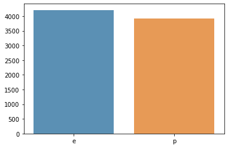
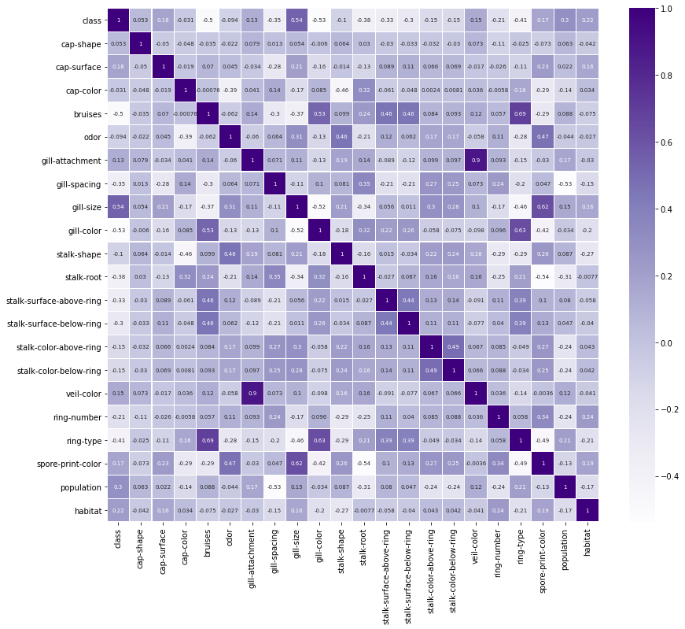

### 랜덤포레스트로 독버섯 분류하기


```python
import pandas as pd
import numpy as np
import seaborn as sns
import matplotlib.pyplot as plt

df=pd.read_csv('mushroom.csv')
df
```


<div>
<style scoped>
    .dataframe tbody tr th:only-of-type {
        vertical-align: middle;
    }

    .dataframe tbody tr th {
        vertical-align: top;
    }

    .dataframe thead th {
        text-align: right;
    }
</style>
<table border="1" class="dataframe">
  <thead>
    <tr style="text-align: right;">
      <th></th>
      <th>class</th>
      <th>cap-shape</th>
      <th>cap-surface</th>
      <th>cap-color</th>
      <th>bruises</th>
      <th>odor</th>
      <th>gill-attachment</th>
      <th>gill-spacing</th>
      <th>gill-size</th>
      <th>gill-color</th>
      <th>...</th>
      <th>stalk-surface-below-ring</th>
      <th>stalk-color-above-ring</th>
      <th>stalk-color-below-ring</th>
      <th>veil-type</th>
      <th>veil-color</th>
      <th>ring-number</th>
      <th>ring-type</th>
      <th>spore-print-color</th>
      <th>population</th>
      <th>habitat</th>
    </tr>
  </thead>
  <tbody>
    <tr>
      <th>0</th>
      <td>p</td>
      <td>x</td>
      <td>s</td>
      <td>n</td>
      <td>t</td>
      <td>p</td>
      <td>f</td>
      <td>c</td>
      <td>n</td>
      <td>k</td>
      <td>...</td>
      <td>s</td>
      <td>w</td>
      <td>w</td>
      <td>p</td>
      <td>w</td>
      <td>o</td>
      <td>p</td>
      <td>k</td>
      <td>s</td>
      <td>u</td>
    </tr>
    <tr>
      <th>1</th>
      <td>e</td>
      <td>x</td>
      <td>s</td>
      <td>y</td>
      <td>t</td>
      <td>a</td>
      <td>f</td>
      <td>c</td>
      <td>b</td>
      <td>k</td>
      <td>...</td>
      <td>s</td>
      <td>w</td>
      <td>w</td>
      <td>p</td>
      <td>w</td>
      <td>o</td>
      <td>p</td>
      <td>n</td>
      <td>n</td>
      <td>g</td>
    </tr>
    <tr>
      <th>2</th>
      <td>e</td>
      <td>b</td>
      <td>s</td>
      <td>w</td>
      <td>t</td>
      <td>l</td>
      <td>f</td>
      <td>c</td>
      <td>b</td>
      <td>n</td>
      <td>...</td>
      <td>s</td>
      <td>w</td>
      <td>w</td>
      <td>p</td>
      <td>w</td>
      <td>o</td>
      <td>p</td>
      <td>n</td>
      <td>n</td>
      <td>m</td>
    </tr>
    <tr>
      <th>3</th>
      <td>p</td>
      <td>x</td>
      <td>y</td>
      <td>w</td>
      <td>t</td>
      <td>p</td>
      <td>f</td>
      <td>c</td>
      <td>n</td>
      <td>n</td>
      <td>...</td>
      <td>s</td>
      <td>w</td>
      <td>w</td>
      <td>p</td>
      <td>w</td>
      <td>o</td>
      <td>p</td>
      <td>k</td>
      <td>s</td>
      <td>u</td>
    </tr>
    <tr>
      <th>4</th>
      <td>e</td>
      <td>x</td>
      <td>s</td>
      <td>g</td>
      <td>f</td>
      <td>n</td>
      <td>f</td>
      <td>w</td>
      <td>b</td>
      <td>k</td>
      <td>...</td>
      <td>s</td>
      <td>w</td>
      <td>w</td>
      <td>p</td>
      <td>w</td>
      <td>o</td>
      <td>e</td>
      <td>n</td>
      <td>a</td>
      <td>g</td>
    </tr>
    <tr>
      <th>...</th>
      <td>...</td>
      <td>...</td>
      <td>...</td>
      <td>...</td>
      <td>...</td>
      <td>...</td>
      <td>...</td>
      <td>...</td>
      <td>...</td>
      <td>...</td>
      <td>...</td>
      <td>...</td>
      <td>...</td>
      <td>...</td>
      <td>...</td>
      <td>...</td>
      <td>...</td>
      <td>...</td>
      <td>...</td>
      <td>...</td>
      <td>...</td>
    </tr>
    <tr>
      <th>8119</th>
      <td>e</td>
      <td>k</td>
      <td>s</td>
      <td>n</td>
      <td>f</td>
      <td>n</td>
      <td>a</td>
      <td>c</td>
      <td>b</td>
      <td>y</td>
      <td>...</td>
      <td>s</td>
      <td>o</td>
      <td>o</td>
      <td>p</td>
      <td>o</td>
      <td>o</td>
      <td>p</td>
      <td>b</td>
      <td>c</td>
      <td>l</td>
    </tr>
    <tr>
      <th>8120</th>
      <td>e</td>
      <td>x</td>
      <td>s</td>
      <td>n</td>
      <td>f</td>
      <td>n</td>
      <td>a</td>
      <td>c</td>
      <td>b</td>
      <td>y</td>
      <td>...</td>
      <td>s</td>
      <td>o</td>
      <td>o</td>
      <td>p</td>
      <td>n</td>
      <td>o</td>
      <td>p</td>
      <td>b</td>
      <td>v</td>
      <td>l</td>
    </tr>
    <tr>
      <th>8121</th>
      <td>e</td>
      <td>f</td>
      <td>s</td>
      <td>n</td>
      <td>f</td>
      <td>n</td>
      <td>a</td>
      <td>c</td>
      <td>b</td>
      <td>n</td>
      <td>...</td>
      <td>s</td>
      <td>o</td>
      <td>o</td>
      <td>p</td>
      <td>o</td>
      <td>o</td>
      <td>p</td>
      <td>b</td>
      <td>c</td>
      <td>l</td>
    </tr>
    <tr>
      <th>8122</th>
      <td>p</td>
      <td>k</td>
      <td>y</td>
      <td>n</td>
      <td>f</td>
      <td>y</td>
      <td>f</td>
      <td>c</td>
      <td>n</td>
      <td>b</td>
      <td>...</td>
      <td>k</td>
      <td>w</td>
      <td>w</td>
      <td>p</td>
      <td>w</td>
      <td>o</td>
      <td>e</td>
      <td>w</td>
      <td>v</td>
      <td>l</td>
    </tr>
    <tr>
      <th>8123</th>
      <td>e</td>
      <td>x</td>
      <td>s</td>
      <td>n</td>
      <td>f</td>
      <td>n</td>
      <td>a</td>
      <td>c</td>
      <td>b</td>
      <td>y</td>
      <td>...</td>
      <td>s</td>
      <td>o</td>
      <td>o</td>
      <td>p</td>
      <td>o</td>
      <td>o</td>
      <td>p</td>
      <td>o</td>
      <td>c</td>
      <td>l</td>
    </tr>
  </tbody>
</table>
<p>8124 rows × 23 columns</p>
</div>


```python
df.info()
```

    <class 'pandas.core.frame.DataFrame'>
    RangeIndex: 8124 entries, 0 to 8123
    Data columns (total 23 columns):
     #   Column                    Non-Null Count  Dtype 
    ---  ------                    --------------  ----- 
     0   class                     8124 non-null   object
     1   cap-shape                 8124 non-null   object
     2   cap-surface               8124 non-null   object
     3   cap-color                 8124 non-null   object
     4   bruises                   8124 non-null   object
     5   odor                      8124 non-null   object
     6   gill-attachment           8124 non-null   object
     7   gill-spacing              8124 non-null   object
     8   gill-size                 8124 non-null   object
     9   gill-color                8124 non-null   object
     10  stalk-shape               8124 non-null   object
     11  stalk-root                8124 non-null   object
     12  stalk-surface-above-ring  8124 non-null   object
     13  stalk-surface-below-ring  8124 non-null   object
     14  stalk-color-above-ring    8124 non-null   object
     15  stalk-color-below-ring    8124 non-null   object
     16  veil-type                 8124 non-null   object
     17  veil-color                8124 non-null   object
     18  ring-number               8124 non-null   object
     19  ring-type                 8124 non-null   object
     20  spore-print-color         8124 non-null   object
     21  population                8124 non-null   object
     22  habitat                   8124 non-null   object
    dtypes: object(23)
    memory usage: 1.4+ MB
    

null값 없고 모두 object


```python
df.describe()
```


<div>
<style scoped>
    .dataframe tbody tr th:only-of-type {
        vertical-align: middle;
    }

    .dataframe tbody tr th {
        vertical-align: top;
    }

    .dataframe thead th {
        text-align: right;
    }
</style>
<table border="1" class="dataframe">
  <thead>
    <tr style="text-align: right;">
      <th></th>
      <th>class</th>
      <th>cap-shape</th>
      <th>cap-surface</th>
      <th>cap-color</th>
      <th>bruises</th>
      <th>odor</th>
      <th>gill-attachment</th>
      <th>gill-spacing</th>
      <th>gill-size</th>
      <th>gill-color</th>
      <th>...</th>
      <th>stalk-surface-below-ring</th>
      <th>stalk-color-above-ring</th>
      <th>stalk-color-below-ring</th>
      <th>veil-type</th>
      <th>veil-color</th>
      <th>ring-number</th>
      <th>ring-type</th>
      <th>spore-print-color</th>
      <th>population</th>
      <th>habitat</th>
    </tr>
  </thead>
  <tbody>
    <tr>
      <th>count</th>
      <td>8124</td>
      <td>8124</td>
      <td>8124</td>
      <td>8124</td>
      <td>8124</td>
      <td>8124</td>
      <td>8124</td>
      <td>8124</td>
      <td>8124</td>
      <td>8124</td>
      <td>...</td>
      <td>8124</td>
      <td>8124</td>
      <td>8124</td>
      <td>8124</td>
      <td>8124</td>
      <td>8124</td>
      <td>8124</td>
      <td>8124</td>
      <td>8124</td>
      <td>8124</td>
    </tr>
    <tr>
      <th>unique</th>
      <td>2</td>
      <td>6</td>
      <td>4</td>
      <td>10</td>
      <td>2</td>
      <td>9</td>
      <td>2</td>
      <td>2</td>
      <td>2</td>
      <td>12</td>
      <td>...</td>
      <td>4</td>
      <td>9</td>
      <td>9</td>
      <td>1</td>
      <td>4</td>
      <td>3</td>
      <td>5</td>
      <td>9</td>
      <td>6</td>
      <td>7</td>
    </tr>
    <tr>
      <th>top</th>
      <td>e</td>
      <td>x</td>
      <td>y</td>
      <td>n</td>
      <td>f</td>
      <td>n</td>
      <td>f</td>
      <td>c</td>
      <td>b</td>
      <td>b</td>
      <td>...</td>
      <td>s</td>
      <td>w</td>
      <td>w</td>
      <td>p</td>
      <td>w</td>
      <td>o</td>
      <td>p</td>
      <td>w</td>
      <td>v</td>
      <td>d</td>
    </tr>
    <tr>
      <th>freq</th>
      <td>4208</td>
      <td>3656</td>
      <td>3244</td>
      <td>2284</td>
      <td>4748</td>
      <td>3528</td>
      <td>7914</td>
      <td>6812</td>
      <td>5612</td>
      <td>1728</td>
      <td>...</td>
      <td>4936</td>
      <td>4464</td>
      <td>4384</td>
      <td>8124</td>
      <td>7924</td>
      <td>7488</td>
      <td>3968</td>
      <td>2388</td>
      <td>4040</td>
      <td>3148</td>
    </tr>
  </tbody>
</table>
<p>4 rows × 23 columns</p>
</div>


#### 각 칼럼 정보  

1. cap-shape: bell=b,conical=c,convex=x,flat=f, knobbed=k,sunken=s
2. cap-surface: fibrous=f,grooves=g,scaly=y,smooth=s
3. cap-color: brown=n,buff=b,cinnamon=c,gray=g,green=r, pink=p,purple=u,red=e,white=w,yellow=y
4. bruises?: bruises=t,no=f
5. odor: almond=a,anise=l,creosote=c,fishy=y,foul=f, musty=m,none=n,pungent=p,spicy=s
6. gill-attachment: attached=a,descending=d,free=f,notched=n
7. gill-spacing: close=c,crowded=w,distant=d
8. gill-size: broad=b,narrow=n
9. gill-color: black=k,brown=n,buff=b,chocolate=h,gray=g, green=r,orange=o,pink=p,purple=u,red=e, white=w,yellow=y
10. stalk-shape: enlarging=e,tapering=t
11. stalk-root: bulbous=b,club=c,cup=u,equal=e, rhizomorphs=z,rooted=r,missing=?
12. stalk-surface-above-ring: fibrous=f,scaly=y,silky=k,smooth=s
13. stalk-surface-below-ring: fibrous=f,scaly=y,silky=k,smooth=s
14. stalk-color-above-ring: brown=n,buff=b,cinnamon=c,gray=g,orange=o, pink=p,red=e,white=w,yellow=y
15. stalk-color-below-ring: brown=n,buff=b,cinnamon=c,gray=g,orange=o, pink=p,red=e,white=w,yellow=y
16. veil-type: partial=p,universal=u
17. veil-color: brown=n,orange=o,white=w,yellow=y
18. ring-number: none=n,one=o,two=t
19. ring-type: cobwebby=c,evanescent=e,flaring=f,large=l, none=n,pendant=p,sheathing=s,zone=z
20. spore-print-color: black=k,brown=n,buff=b,chocolate=h,green=r, orange=o,purple=u,white=w,yellow=y
21. population: abundant=a,clustered=c,numerous=n, scattered=s,several=v,solitary=y
22. habitat: grasses=g,leaves=l,meadows=m,paths=p, urban=u,waste=w,woods=d


```python
df['class'].unique() #p가 독버섯
```


    array(['p', 'e'], dtype=object)


```python
cnt=df['class'].value_counts()
sns.barplot(cnt.index,cnt.values,alpha=0.8)

```

    C:\ProgramData\Anaconda3\lib\site-packages\seaborn\_decorators.py:36: FutureWarning: Pass the following variables as keyword args: x, y. From version 0.12, the only valid positional argument will be `data`, and passing other arguments without an explicit keyword will result in an error or misinterpretation.
      warnings.warn(
    


    <AxesSubplot:>


    

    


```python
df['veil-type']
```


    0       p
    1       p
    2       p
    3       p
    4       p
           ..
    8119    p
    8120    p
    8121    p
    8122    p
    8123    p
    Name: veil-type, Length: 8124, dtype: object


```python
df = df.drop(["veil-type"],axis=1)
```


```python
labelencoder=LabelEncoder()
for column in df.columns:
    df[column] = labelencoder.fit_transform(df[column])
```


```python
plt.figure(figsize=(14,12))
sns.heatmap(df.corr(),linewidths=.1,cmap="Purples", annot=True, annot_kws={"size": 7})
plt.yticks(rotation=0);
```


    

    


```python
from sklearn.ensemble import RandomForestClassifier
from sklearn import metrics
from sklearn.model_selection import train_test_split
```

y는 0행인 class로, X는 그 외로 설정


```python
X=df.drop('class',axis=1)
X
```


<div>
<style scoped>
    .dataframe tbody tr th:only-of-type {
        vertical-align: middle;
    }

    .dataframe tbody tr th {
        vertical-align: top;
    }

    .dataframe thead th {
        text-align: right;
    }
</style>
<table border="1" class="dataframe">
  <thead>
    <tr style="text-align: right;">
      <th></th>
      <th>cap-shape</th>
      <th>cap-surface</th>
      <th>cap-color</th>
      <th>bruises</th>
      <th>odor</th>
      <th>gill-attachment</th>
      <th>gill-spacing</th>
      <th>gill-size</th>
      <th>gill-color</th>
      <th>stalk-shape</th>
      <th>...</th>
      <th>stalk-surface-below-ring</th>
      <th>stalk-color-above-ring</th>
      <th>stalk-color-below-ring</th>
      <th>veil-type</th>
      <th>veil-color</th>
      <th>ring-number</th>
      <th>ring-type</th>
      <th>spore-print-color</th>
      <th>population</th>
      <th>habitat</th>
    </tr>
  </thead>
  <tbody>
    <tr>
      <th>0</th>
      <td>x</td>
      <td>s</td>
      <td>n</td>
      <td>t</td>
      <td>p</td>
      <td>f</td>
      <td>c</td>
      <td>n</td>
      <td>k</td>
      <td>e</td>
      <td>...</td>
      <td>s</td>
      <td>w</td>
      <td>w</td>
      <td>p</td>
      <td>w</td>
      <td>o</td>
      <td>p</td>
      <td>k</td>
      <td>s</td>
      <td>u</td>
    </tr>
    <tr>
      <th>1</th>
      <td>x</td>
      <td>s</td>
      <td>y</td>
      <td>t</td>
      <td>a</td>
      <td>f</td>
      <td>c</td>
      <td>b</td>
      <td>k</td>
      <td>e</td>
      <td>...</td>
      <td>s</td>
      <td>w</td>
      <td>w</td>
      <td>p</td>
      <td>w</td>
      <td>o</td>
      <td>p</td>
      <td>n</td>
      <td>n</td>
      <td>g</td>
    </tr>
    <tr>
      <th>2</th>
      <td>b</td>
      <td>s</td>
      <td>w</td>
      <td>t</td>
      <td>l</td>
      <td>f</td>
      <td>c</td>
      <td>b</td>
      <td>n</td>
      <td>e</td>
      <td>...</td>
      <td>s</td>
      <td>w</td>
      <td>w</td>
      <td>p</td>
      <td>w</td>
      <td>o</td>
      <td>p</td>
      <td>n</td>
      <td>n</td>
      <td>m</td>
    </tr>
    <tr>
      <th>3</th>
      <td>x</td>
      <td>y</td>
      <td>w</td>
      <td>t</td>
      <td>p</td>
      <td>f</td>
      <td>c</td>
      <td>n</td>
      <td>n</td>
      <td>e</td>
      <td>...</td>
      <td>s</td>
      <td>w</td>
      <td>w</td>
      <td>p</td>
      <td>w</td>
      <td>o</td>
      <td>p</td>
      <td>k</td>
      <td>s</td>
      <td>u</td>
    </tr>
    <tr>
      <th>4</th>
      <td>x</td>
      <td>s</td>
      <td>g</td>
      <td>f</td>
      <td>n</td>
      <td>f</td>
      <td>w</td>
      <td>b</td>
      <td>k</td>
      <td>t</td>
      <td>...</td>
      <td>s</td>
      <td>w</td>
      <td>w</td>
      <td>p</td>
      <td>w</td>
      <td>o</td>
      <td>e</td>
      <td>n</td>
      <td>a</td>
      <td>g</td>
    </tr>
    <tr>
      <th>...</th>
      <td>...</td>
      <td>...</td>
      <td>...</td>
      <td>...</td>
      <td>...</td>
      <td>...</td>
      <td>...</td>
      <td>...</td>
      <td>...</td>
      <td>...</td>
      <td>...</td>
      <td>...</td>
      <td>...</td>
      <td>...</td>
      <td>...</td>
      <td>...</td>
      <td>...</td>
      <td>...</td>
      <td>...</td>
      <td>...</td>
      <td>...</td>
    </tr>
    <tr>
      <th>8119</th>
      <td>k</td>
      <td>s</td>
      <td>n</td>
      <td>f</td>
      <td>n</td>
      <td>a</td>
      <td>c</td>
      <td>b</td>
      <td>y</td>
      <td>e</td>
      <td>...</td>
      <td>s</td>
      <td>o</td>
      <td>o</td>
      <td>p</td>
      <td>o</td>
      <td>o</td>
      <td>p</td>
      <td>b</td>
      <td>c</td>
      <td>l</td>
    </tr>
    <tr>
      <th>8120</th>
      <td>x</td>
      <td>s</td>
      <td>n</td>
      <td>f</td>
      <td>n</td>
      <td>a</td>
      <td>c</td>
      <td>b</td>
      <td>y</td>
      <td>e</td>
      <td>...</td>
      <td>s</td>
      <td>o</td>
      <td>o</td>
      <td>p</td>
      <td>n</td>
      <td>o</td>
      <td>p</td>
      <td>b</td>
      <td>v</td>
      <td>l</td>
    </tr>
    <tr>
      <th>8121</th>
      <td>f</td>
      <td>s</td>
      <td>n</td>
      <td>f</td>
      <td>n</td>
      <td>a</td>
      <td>c</td>
      <td>b</td>
      <td>n</td>
      <td>e</td>
      <td>...</td>
      <td>s</td>
      <td>o</td>
      <td>o</td>
      <td>p</td>
      <td>o</td>
      <td>o</td>
      <td>p</td>
      <td>b</td>
      <td>c</td>
      <td>l</td>
    </tr>
    <tr>
      <th>8122</th>
      <td>k</td>
      <td>y</td>
      <td>n</td>
      <td>f</td>
      <td>y</td>
      <td>f</td>
      <td>c</td>
      <td>n</td>
      <td>b</td>
      <td>t</td>
      <td>...</td>
      <td>k</td>
      <td>w</td>
      <td>w</td>
      <td>p</td>
      <td>w</td>
      <td>o</td>
      <td>e</td>
      <td>w</td>
      <td>v</td>
      <td>l</td>
    </tr>
    <tr>
      <th>8123</th>
      <td>x</td>
      <td>s</td>
      <td>n</td>
      <td>f</td>
      <td>n</td>
      <td>a</td>
      <td>c</td>
      <td>b</td>
      <td>y</td>
      <td>e</td>
      <td>...</td>
      <td>s</td>
      <td>o</td>
      <td>o</td>
      <td>p</td>
      <td>o</td>
      <td>o</td>
      <td>p</td>
      <td>o</td>
      <td>c</td>
      <td>l</td>
    </tr>
  </tbody>
</table>
<p>8124 rows × 22 columns</p>
</div>


```python
y=df['class']
y
```


    0       p
    1       e
    2       e
    3       p
    4       e
           ..
    8119    e
    8120    e
    8121    e
    8122    p
    8123    e
    Name: class, Length: 8124, dtype: object


```python
from sklearn.preprocessing import LabelEncoder
X2=LabelEncoder()
for col in X.columns:
    X[col]=X2.fit_transform(X[col])
y2=LabelEncoder()
y=y2.fit_transform(y)
X.head(10)
```


<div>
<style scoped>
    .dataframe tbody tr th:only-of-type {
        vertical-align: middle;
    }

    .dataframe tbody tr th {
        vertical-align: top;
    }

    .dataframe thead th {
        text-align: right;
    }
</style>
<table border="1" class="dataframe">
  <thead>
    <tr style="text-align: right;">
      <th></th>
      <th>cap-shape</th>
      <th>cap-surface</th>
      <th>cap-color</th>
      <th>bruises</th>
      <th>odor</th>
      <th>gill-attachment</th>
      <th>gill-spacing</th>
      <th>gill-size</th>
      <th>gill-color</th>
      <th>stalk-shape</th>
      <th>...</th>
      <th>stalk-surface-below-ring</th>
      <th>stalk-color-above-ring</th>
      <th>stalk-color-below-ring</th>
      <th>veil-type</th>
      <th>veil-color</th>
      <th>ring-number</th>
      <th>ring-type</th>
      <th>spore-print-color</th>
      <th>population</th>
      <th>habitat</th>
    </tr>
  </thead>
  <tbody>
    <tr>
      <th>0</th>
      <td>5</td>
      <td>2</td>
      <td>4</td>
      <td>1</td>
      <td>6</td>
      <td>1</td>
      <td>0</td>
      <td>1</td>
      <td>4</td>
      <td>0</td>
      <td>...</td>
      <td>2</td>
      <td>7</td>
      <td>7</td>
      <td>0</td>
      <td>2</td>
      <td>1</td>
      <td>4</td>
      <td>2</td>
      <td>3</td>
      <td>5</td>
    </tr>
    <tr>
      <th>1</th>
      <td>5</td>
      <td>2</td>
      <td>9</td>
      <td>1</td>
      <td>0</td>
      <td>1</td>
      <td>0</td>
      <td>0</td>
      <td>4</td>
      <td>0</td>
      <td>...</td>
      <td>2</td>
      <td>7</td>
      <td>7</td>
      <td>0</td>
      <td>2</td>
      <td>1</td>
      <td>4</td>
      <td>3</td>
      <td>2</td>
      <td>1</td>
    </tr>
    <tr>
      <th>2</th>
      <td>0</td>
      <td>2</td>
      <td>8</td>
      <td>1</td>
      <td>3</td>
      <td>1</td>
      <td>0</td>
      <td>0</td>
      <td>5</td>
      <td>0</td>
      <td>...</td>
      <td>2</td>
      <td>7</td>
      <td>7</td>
      <td>0</td>
      <td>2</td>
      <td>1</td>
      <td>4</td>
      <td>3</td>
      <td>2</td>
      <td>3</td>
    </tr>
    <tr>
      <th>3</th>
      <td>5</td>
      <td>3</td>
      <td>8</td>
      <td>1</td>
      <td>6</td>
      <td>1</td>
      <td>0</td>
      <td>1</td>
      <td>5</td>
      <td>0</td>
      <td>...</td>
      <td>2</td>
      <td>7</td>
      <td>7</td>
      <td>0</td>
      <td>2</td>
      <td>1</td>
      <td>4</td>
      <td>2</td>
      <td>3</td>
      <td>5</td>
    </tr>
    <tr>
      <th>4</th>
      <td>5</td>
      <td>2</td>
      <td>3</td>
      <td>0</td>
      <td>5</td>
      <td>1</td>
      <td>1</td>
      <td>0</td>
      <td>4</td>
      <td>1</td>
      <td>...</td>
      <td>2</td>
      <td>7</td>
      <td>7</td>
      <td>0</td>
      <td>2</td>
      <td>1</td>
      <td>0</td>
      <td>3</td>
      <td>0</td>
      <td>1</td>
    </tr>
    <tr>
      <th>5</th>
      <td>5</td>
      <td>3</td>
      <td>9</td>
      <td>1</td>
      <td>0</td>
      <td>1</td>
      <td>0</td>
      <td>0</td>
      <td>5</td>
      <td>0</td>
      <td>...</td>
      <td>2</td>
      <td>7</td>
      <td>7</td>
      <td>0</td>
      <td>2</td>
      <td>1</td>
      <td>4</td>
      <td>2</td>
      <td>2</td>
      <td>1</td>
    </tr>
    <tr>
      <th>6</th>
      <td>0</td>
      <td>2</td>
      <td>8</td>
      <td>1</td>
      <td>0</td>
      <td>1</td>
      <td>0</td>
      <td>0</td>
      <td>2</td>
      <td>0</td>
      <td>...</td>
      <td>2</td>
      <td>7</td>
      <td>7</td>
      <td>0</td>
      <td>2</td>
      <td>1</td>
      <td>4</td>
      <td>2</td>
      <td>2</td>
      <td>3</td>
    </tr>
    <tr>
      <th>7</th>
      <td>0</td>
      <td>3</td>
      <td>8</td>
      <td>1</td>
      <td>3</td>
      <td>1</td>
      <td>0</td>
      <td>0</td>
      <td>5</td>
      <td>0</td>
      <td>...</td>
      <td>2</td>
      <td>7</td>
      <td>7</td>
      <td>0</td>
      <td>2</td>
      <td>1</td>
      <td>4</td>
      <td>3</td>
      <td>3</td>
      <td>3</td>
    </tr>
    <tr>
      <th>8</th>
      <td>5</td>
      <td>3</td>
      <td>8</td>
      <td>1</td>
      <td>6</td>
      <td>1</td>
      <td>0</td>
      <td>1</td>
      <td>7</td>
      <td>0</td>
      <td>...</td>
      <td>2</td>
      <td>7</td>
      <td>7</td>
      <td>0</td>
      <td>2</td>
      <td>1</td>
      <td>4</td>
      <td>2</td>
      <td>4</td>
      <td>1</td>
    </tr>
    <tr>
      <th>9</th>
      <td>0</td>
      <td>2</td>
      <td>9</td>
      <td>1</td>
      <td>0</td>
      <td>1</td>
      <td>0</td>
      <td>0</td>
      <td>2</td>
      <td>0</td>
      <td>...</td>
      <td>2</td>
      <td>7</td>
      <td>7</td>
      <td>0</td>
      <td>2</td>
      <td>1</td>
      <td>4</td>
      <td>2</td>
      <td>3</td>
      <td>3</td>
    </tr>
  </tbody>
</table>
<p>10 rows × 22 columns</p>
</div>


```python
print(y)
```

    [1 0 0 ... 0 1 0]
    


```python
trainX,testX,trainy,testy=train_test_split(X,y,test_size=0.3,random_state=11)
```


```python
from sklearn.preprocessing import StandardScaler
std=StandardScaler()

trainX=std.fit_transform(trainX)
testX=std.transform(testX)
```


```python
trainX
```


    array([[ 1.02750587, -1.49171814, -0.58893851, ..., -0.25554873,
             1.08274802, -0.8724175 ],
           [ 1.02750587,  0.94351279, -0.58893851, ..., -1.09425008,
             0.28403172, -0.29297983],
           [ 1.02750587, -1.49171814,  0.19917737, ..., -0.67489941,
            -0.51468458, -0.8724175 ],
           ...,
           [-0.85107882, -1.49171814, -0.58893851, ..., -1.09425008,
             1.08274802, -0.8724175 ],
           [ 1.02750587, -1.49171814, -0.58893851, ..., -1.09425008,
             1.08274802,  1.44533318],
           [-0.85107882,  0.13176915,  1.3813512 , ..., -0.25554873,
             0.28403172,  2.02477085]])


```python
testX
```


    array([[ 1.02750587,  0.13176915, -0.98299646, ...,  1.42185397,
             0.28403172,  1.44533318],
           [ 1.02750587,  0.94351279, -0.98299646, ..., -0.25554873,
             0.28403172, -0.8724175 ],
           [-0.85107882, -1.49171814, -0.58893851, ..., -0.25554873,
            -0.51468458, -0.29297983],
           ...,
           [-0.85107882,  0.13176915,  1.3813512 , ..., -0.67489941,
             0.28403172,  2.02477085],
           [-0.85107882, -1.49171814,  1.77540914, ..., -1.09425008,
             1.08274802,  1.44533318],
           [-2.10346861, -1.49171814, -0.58893851, ...,  1.42185397,
            -0.51468458, -0.29297983]])


```python
rf=RandomForestClassifier(random_state=11)
rf.fit(trainX,trainy)
```


    RandomForestClassifier(random_state=11)


```python
pred=rf.predict(testX)
```


```python
acc=metrics.accuracy_score(testy,pred)
print(acc*100)
```

    100.0
    


```python
rf=RandomForestClassifier(n_estimators=50,criterion='entropy',random_state=11)
rf.fit(trainX,trainy)
```


    RandomForestClassifier(criterion='entropy', n_estimators=50, random_state=11)


```python
pred=rf.predict(testX)
```


```python
acc=metrics.accuracy_score(testy,pred)
print(acc*100)
```

    100.0
    


```python
print(pred[:50])
```

    [1 0 0 1 0 0 0 0 0 0 1 0 0 0 1 1 1 0 0 0 0 1 0 1 0 0 1 0 1 0 1 0 1 1 1 0 0
     0 0 0 1 0 1 0 1 0 1 1 0 1]
    


```python
print(testy[:50])
```

    [1 0 0 1 0 0 0 0 0 0 1 0 0 0 1 1 1 0 0 0 0 1 0 1 0 0 1 0 1 0 1 0 1 1 1 0 0
     0 0 0 1 0 1 0 1 0 1 1 0 1]
    


```python
from sklearn.linear_model import LogisticRegression
lr = LogisticRegression(solver="lbfgs", max_iter=500)
lr.fit(trainX, trainy)
print(lr.score(testX, testy)*100)
```

    94.97784342688331
    


```python

```
