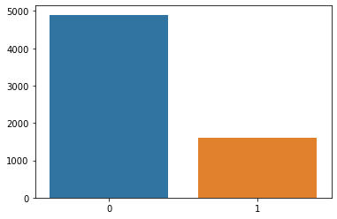
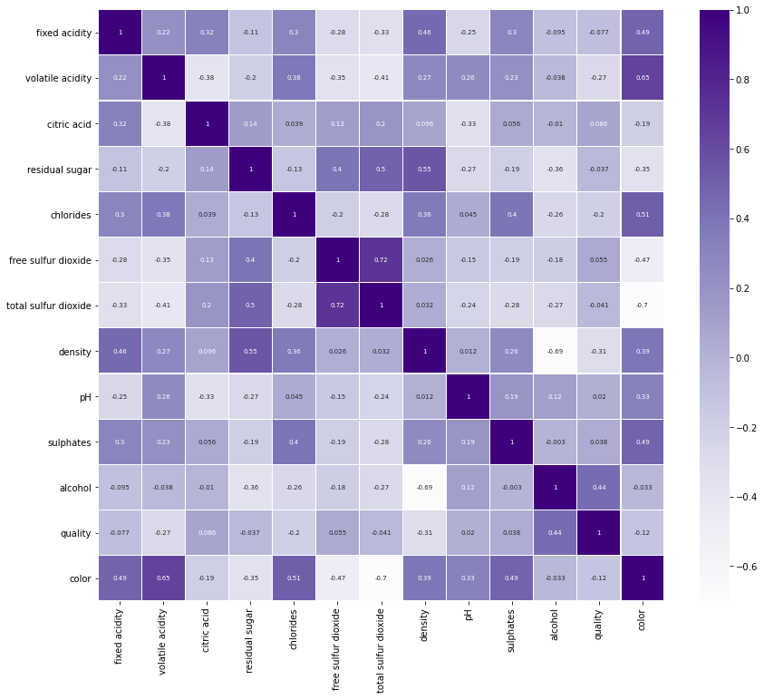
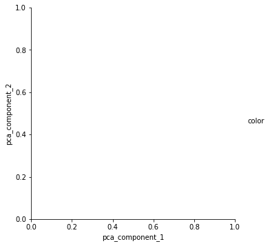
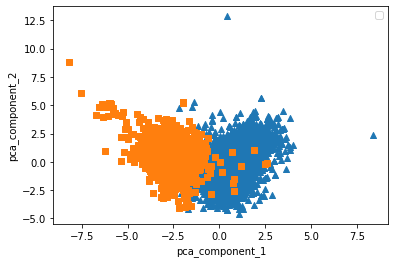
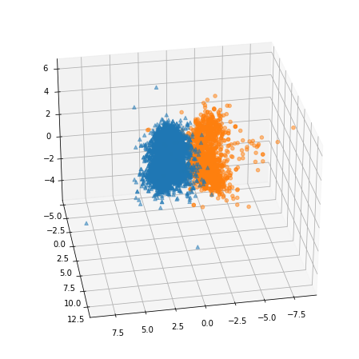

```python
import pandas as pd
import numpy as np
import seaborn as sns
import matplotlib.pyplot as plt

wine_url = 'https://raw.githubusercontent.com/PinkWink/ML_tutorial/master/dataset/wine.csv'

wine = pd.read_csv(wine_url, index_col=0)
```


```python
wine
```


<div>
<style scoped>
    .dataframe tbody tr th:only-of-type {
        vertical-align: middle;
    }

    .dataframe tbody tr th {
        vertical-align: top;
    }

    .dataframe thead th {
        text-align: right;
    }
</style>
<table border="1" class="dataframe">
  <thead>
    <tr style="text-align: right;">
      <th></th>
      <th>fixed acidity</th>
      <th>volatile acidity</th>
      <th>citric acid</th>
      <th>residual sugar</th>
      <th>chlorides</th>
      <th>free sulfur dioxide</th>
      <th>total sulfur dioxide</th>
      <th>density</th>
      <th>pH</th>
      <th>sulphates</th>
      <th>alcohol</th>
      <th>quality</th>
      <th>color</th>
    </tr>
  </thead>
  <tbody>
    <tr>
      <th>0</th>
      <td>7.4</td>
      <td>0.70</td>
      <td>0.00</td>
      <td>1.9</td>
      <td>0.076</td>
      <td>11.0</td>
      <td>34.0</td>
      <td>0.99780</td>
      <td>3.51</td>
      <td>0.56</td>
      <td>9.4</td>
      <td>5</td>
      <td>1</td>
    </tr>
    <tr>
      <th>1</th>
      <td>7.8</td>
      <td>0.88</td>
      <td>0.00</td>
      <td>2.6</td>
      <td>0.098</td>
      <td>25.0</td>
      <td>67.0</td>
      <td>0.99680</td>
      <td>3.20</td>
      <td>0.68</td>
      <td>9.8</td>
      <td>5</td>
      <td>1</td>
    </tr>
    <tr>
      <th>2</th>
      <td>7.8</td>
      <td>0.76</td>
      <td>0.04</td>
      <td>2.3</td>
      <td>0.092</td>
      <td>15.0</td>
      <td>54.0</td>
      <td>0.99700</td>
      <td>3.26</td>
      <td>0.65</td>
      <td>9.8</td>
      <td>5</td>
      <td>1</td>
    </tr>
    <tr>
      <th>3</th>
      <td>11.2</td>
      <td>0.28</td>
      <td>0.56</td>
      <td>1.9</td>
      <td>0.075</td>
      <td>17.0</td>
      <td>60.0</td>
      <td>0.99800</td>
      <td>3.16</td>
      <td>0.58</td>
      <td>9.8</td>
      <td>6</td>
      <td>1</td>
    </tr>
    <tr>
      <th>4</th>
      <td>7.4</td>
      <td>0.70</td>
      <td>0.00</td>
      <td>1.9</td>
      <td>0.076</td>
      <td>11.0</td>
      <td>34.0</td>
      <td>0.99780</td>
      <td>3.51</td>
      <td>0.56</td>
      <td>9.4</td>
      <td>5</td>
      <td>1</td>
    </tr>
    <tr>
      <th>...</th>
      <td>...</td>
      <td>...</td>
      <td>...</td>
      <td>...</td>
      <td>...</td>
      <td>...</td>
      <td>...</td>
      <td>...</td>
      <td>...</td>
      <td>...</td>
      <td>...</td>
      <td>...</td>
      <td>...</td>
    </tr>
    <tr>
      <th>4893</th>
      <td>6.2</td>
      <td>0.21</td>
      <td>0.29</td>
      <td>1.6</td>
      <td>0.039</td>
      <td>24.0</td>
      <td>92.0</td>
      <td>0.99114</td>
      <td>3.27</td>
      <td>0.50</td>
      <td>11.2</td>
      <td>6</td>
      <td>0</td>
    </tr>
    <tr>
      <th>4894</th>
      <td>6.6</td>
      <td>0.32</td>
      <td>0.36</td>
      <td>8.0</td>
      <td>0.047</td>
      <td>57.0</td>
      <td>168.0</td>
      <td>0.99490</td>
      <td>3.15</td>
      <td>0.46</td>
      <td>9.6</td>
      <td>5</td>
      <td>0</td>
    </tr>
    <tr>
      <th>4895</th>
      <td>6.5</td>
      <td>0.24</td>
      <td>0.19</td>
      <td>1.2</td>
      <td>0.041</td>
      <td>30.0</td>
      <td>111.0</td>
      <td>0.99254</td>
      <td>2.99</td>
      <td>0.46</td>
      <td>9.4</td>
      <td>6</td>
      <td>0</td>
    </tr>
    <tr>
      <th>4896</th>
      <td>5.5</td>
      <td>0.29</td>
      <td>0.30</td>
      <td>1.1</td>
      <td>0.022</td>
      <td>20.0</td>
      <td>110.0</td>
      <td>0.98869</td>
      <td>3.34</td>
      <td>0.38</td>
      <td>12.8</td>
      <td>7</td>
      <td>0</td>
    </tr>
    <tr>
      <th>4897</th>
      <td>6.0</td>
      <td>0.21</td>
      <td>0.38</td>
      <td>0.8</td>
      <td>0.020</td>
      <td>22.0</td>
      <td>98.0</td>
      <td>0.98941</td>
      <td>3.26</td>
      <td>0.32</td>
      <td>11.8</td>
      <td>6</td>
      <td>0</td>
    </tr>
  </tbody>
</table>
<p>6497 rows × 13 columns</p>
</div>


wine 색상 맞추는게 목표

* fixed acidity	: 주석산 농도
* volatile acidity	: 아세트산 농도
* citric acid	: 구연산 농도
* residual sugar	: 잔류 당분 농도
* chlorides	: 염화나트륨 농도
* free sulfur dioxide	: 유리 아황산 농도
* total sulfur dioxide	: 총 아황산 농도
* density	: 밀도
* pH	
* sulphates	:황산칼슘 농도
* alcohol	:알코올 도수
* quality	:와인의 맛
* color :
1이 레드와인, 0이 화이트와인


```python
y=wine['color']
x=wine.drop(['color'],axis=1)
```


```python
print(y.head())
print(x.head())
```

    0    1
    1    1
    2    1
    3    1
    4    1
    Name: color, dtype: int64
       fixed acidity  volatile acidity  citric acid  residual sugar  chlorides  \
    0            7.4              0.70         0.00             1.9      0.076   
    1            7.8              0.88         0.00             2.6      0.098   
    2            7.8              0.76         0.04             2.3      0.092   
    3           11.2              0.28         0.56             1.9      0.075   
    4            7.4              0.70         0.00             1.9      0.076   
    
       free sulfur dioxide  total sulfur dioxide  density    pH  sulphates  \
    0                 11.0                  34.0   0.9978  3.51       0.56   
    1                 25.0                  67.0   0.9968  3.20       0.68   
    2                 15.0                  54.0   0.9970  3.26       0.65   
    3                 17.0                  60.0   0.9980  3.16       0.58   
    4                 11.0                  34.0   0.9978  3.51       0.56   
    
       alcohol  quality  
    0      9.4        5  
    1      9.8        5  
    2      9.8        5  
    3      9.8        6  
    4      9.4        5  
    


```python
wine['color'].unique()
```


    array([1, 0], dtype=int64)


```python
bar=wine['color'].value_counts()
print(bar)
sns.barplot(bar.index,bar.values)
```

    0    4898
    1    1599
    Name: color, dtype: int64
    

    C:\ProgramData\Anaconda3\lib\site-packages\seaborn\_decorators.py:36: FutureWarning: Pass the following variables as keyword args: x, y. From version 0.12, the only valid positional argument will be `data`, and passing other arguments without an explicit keyword will result in an error or misinterpretation.
      warnings.warn(
    


    <AxesSubplot:>


    

    


```python
plt.figure(figsize=(14,12))
sns.heatmap(wine.corr(),linewidths=.1,cmap="Purples", annot=True, annot_kws={"size": 7})
plt.yticks(rotation=0);
```


    

    


```python
from sklearn.preprocessing import StandardScaler
std=StandardScaler()

wine2=std.fit_transform(x)
```


```python
wine2
```


    array([[ 0.14247327,  2.18883292, -2.19283252, ...,  0.19309677,
            -0.91546416, -0.93722961],
           [ 0.45103572,  3.28223494, -2.19283252, ...,  0.99957862,
            -0.58006813, -0.93722961],
           [ 0.45103572,  2.55330026, -1.91755268, ...,  0.79795816,
            -0.58006813, -0.93722961],
           ...,
           [-0.55179227, -0.6054167 , -0.88525328, ..., -0.47897144,
            -0.91546416,  0.20799905],
           [-1.32319841, -0.30169391, -0.12823371, ..., -1.016626  ,
             1.9354021 ,  1.35322771],
           [-0.93749534, -0.78765037,  0.42232597, ..., -1.41986693,
             1.09691202,  0.20799905]])


```python
wine2.shape
```


    (6497, 12)


```python
from sklearn.decomposition import PCA
```


```python
pca=PCA(n_components=2)
pca.fit(wine2)
pca_wine=pca.transform(wine2)
```


```python
pca_wine.shape
```


    (6497, 2)


```python
pca_wine
```


    array([[-3.34843817,  0.56892617],
           [-3.22859545,  1.19733465],
           [-3.23746833,  0.95258001],
           ...,
           [ 0.62692235, -0.62214478],
           [ 0.49193416, -3.75592792],
           [ 0.76155534, -2.7678397 ]])


```python
pca_col=['pca_component_1','pca_component_2']
df=pd.DataFrame(pca_wine,columns=pca_col)
df['color']=y.values
```


```python
df
```


<div>
<style scoped>
    .dataframe tbody tr th:only-of-type {
        vertical-align: middle;
    }

    .dataframe tbody tr th {
        vertical-align: top;
    }

    .dataframe thead th {
        text-align: right;
    }
</style>
<table border="1" class="dataframe">
  <thead>
    <tr style="text-align: right;">
      <th></th>
      <th>pca_component_1</th>
      <th>pca_component_2</th>
      <th>color</th>
    </tr>
  </thead>
  <tbody>
    <tr>
      <th>0</th>
      <td>-3.348438</td>
      <td>0.568926</td>
      <td>1</td>
    </tr>
    <tr>
      <th>1</th>
      <td>-3.228595</td>
      <td>1.197335</td>
      <td>1</td>
    </tr>
    <tr>
      <th>2</th>
      <td>-3.237468</td>
      <td>0.952580</td>
      <td>1</td>
    </tr>
    <tr>
      <th>3</th>
      <td>-1.672561</td>
      <td>1.600583</td>
      <td>1</td>
    </tr>
    <tr>
      <th>4</th>
      <td>-3.348438</td>
      <td>0.568926</td>
      <td>1</td>
    </tr>
    <tr>
      <th>...</th>
      <td>...</td>
      <td>...</td>
      <td>...</td>
    </tr>
    <tr>
      <th>6492</th>
      <td>0.112718</td>
      <td>-1.912247</td>
      <td>0</td>
    </tr>
    <tr>
      <th>6493</th>
      <td>1.720296</td>
      <td>1.009571</td>
      <td>0</td>
    </tr>
    <tr>
      <th>6494</th>
      <td>0.626922</td>
      <td>-0.622145</td>
      <td>0</td>
    </tr>
    <tr>
      <th>6495</th>
      <td>0.491934</td>
      <td>-3.755928</td>
      <td>0</td>
    </tr>
    <tr>
      <th>6496</th>
      <td>0.761555</td>
      <td>-2.767840</td>
      <td>0</td>
    </tr>
  </tbody>
</table>
<p>6497 rows × 3 columns</p>
</div>


```python
sns.pairplot(df,hue='color',height=5, x_vars = ['pca_component_1'], y_vars = 'pca_component_2')
plt.show()
```


    

    


```python
#setosa를 세모, versicolor를 네모, virginica를 동그라미로 표시
markers=['^', 's']

for i, marker in enumerate(markers):
    x_axis_data = df[df['color']==i]['pca_component_1']
    y_axis_data = df[df['color']==i]['pca_component_2']
    plt.scatter(x_axis_data, y_axis_data, marker=marker)

plt.legend()
plt.xlabel('pca_component_1')
plt.ylabel('pca_component_2')
plt.show()
```

    No handles with labels found to put in legend.
    


    

    


```python
pca_X = df[['pca_component_1', 'pca_component_2']]
```


```python
from sklearn.ensemble import RandomForestClassifier
from sklearn.model_selection import cross_val_score
import numpy as np

rcf = RandomForestClassifier(random_state=156)
scores = cross_val_score(rcf, x, y,scoring='accuracy',cv=2)
print(scores)
print(np.mean(scores))
```

    [0.99445983 0.9830665 ]
    0.9887631681290341
    


```python
from sklearn.ensemble import RandomForestClassifier
from sklearn.model_selection import cross_val_score
import numpy as np

rcf = RandomForestClassifier(random_state=156)
scores = cross_val_score(rcf, pca_X, y,scoring='accuracy',cv=2)
print(scores)
print(np.mean(scores))
```

    [0.98214835 0.97198276]
    0.9770655559800894
    

#### 주성분 3개로


```python
pca=PCA(n_components=3)
pca.fit(wine2)
pca_wine=pca.transform(wine2)
```


```python
pca_wine.shape
```


    (6497, 3)


```python
pca_col = ['pca_1', 'pca_2', 'pca_3']
df=pd.DataFrame(pca_wine,columns=pca_col)
df['color']=y.values
```


```python
df
```


<div>
<style scoped>
    .dataframe tbody tr th:only-of-type {
        vertical-align: middle;
    }

    .dataframe tbody tr th {
        vertical-align: top;
    }

    .dataframe thead th {
        text-align: right;
    }
</style>
<table border="1" class="dataframe">
  <thead>
    <tr style="text-align: right;">
      <th></th>
      <th>pca_1</th>
      <th>pca_2</th>
      <th>pca_3</th>
      <th>color</th>
    </tr>
  </thead>
  <tbody>
    <tr>
      <th>0</th>
      <td>-3.348438</td>
      <td>0.568926</td>
      <td>-2.727386</td>
      <td>1</td>
    </tr>
    <tr>
      <th>1</th>
      <td>-3.228595</td>
      <td>1.197335</td>
      <td>-1.998904</td>
      <td>1</td>
    </tr>
    <tr>
      <th>2</th>
      <td>-3.237468</td>
      <td>0.952580</td>
      <td>-1.746578</td>
      <td>1</td>
    </tr>
    <tr>
      <th>3</th>
      <td>-1.672561</td>
      <td>1.600583</td>
      <td>2.856552</td>
      <td>1</td>
    </tr>
    <tr>
      <th>4</th>
      <td>-3.348438</td>
      <td>0.568926</td>
      <td>-2.727386</td>
      <td>1</td>
    </tr>
    <tr>
      <th>...</th>
      <td>...</td>
      <td>...</td>
      <td>...</td>
      <td>...</td>
    </tr>
    <tr>
      <th>6492</th>
      <td>0.112718</td>
      <td>-1.912247</td>
      <td>-0.061138</td>
      <td>0</td>
    </tr>
    <tr>
      <th>6493</th>
      <td>1.720296</td>
      <td>1.009571</td>
      <td>-0.662488</td>
      <td>0</td>
    </tr>
    <tr>
      <th>6494</th>
      <td>0.626922</td>
      <td>-0.622145</td>
      <td>-0.149483</td>
      <td>0</td>
    </tr>
    <tr>
      <th>6495</th>
      <td>0.491934</td>
      <td>-3.755928</td>
      <td>-0.080284</td>
      <td>0</td>
    </tr>
    <tr>
      <th>6496</th>
      <td>0.761555</td>
      <td>-2.767840</td>
      <td>0.176820</td>
      <td>0</td>
    </tr>
  </tbody>
</table>
<p>6497 rows × 4 columns</p>
</div>


```python
from mpl_toolkits.mplot3d import Axes3D

markers = ['^', 'o']

fig = plt.figure(figsize=(10, 8))
ax = fig.add_subplot(111, projection='3d')

for i, marker in enumerate(markers):
    x_axis_data =df[df['color'] == i]['pca_1']
    y_axis_data = df[df['color'] == i]['pca_2']
    z_axis_data = df[df['color'] == i]['pca_3']

    ax.scatter(x_axis_data, y_axis_data, z_axis_data,
               s=20, alpha=0.5, marker=marker)
    
ax.view_init(30, 80)
plt.show()
```


    

    


```python
rcf = RandomForestClassifier(random_state=156)
scores = cross_val_score(rcf, x, y,scoring='accuracy',cv=3)
print(scores)
print(np.mean(scores))
```

    [0.99261311 0.99445983 0.99122402]
    0.9927656546658166
    


```python
pca_X=df[['pca_1', 'pca_2', 'pca_3']]
```


```python
rcf = RandomForestClassifier(random_state=156)
scores = cross_val_score(rcf, pca_X, y,scoring='accuracy',cv=3)
print(scores)
print(np.mean(scores))
```

    [0.97830102 0.98614958 0.98013857]
    0.9815297227713341
    


```python

```
